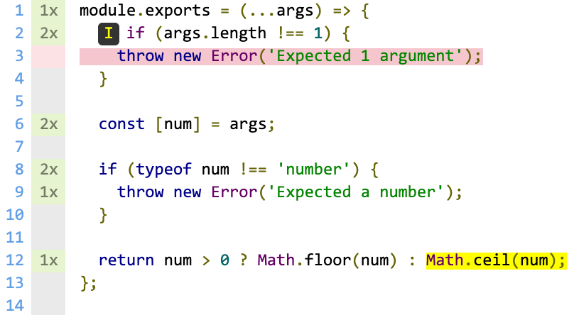

# coverage

[](https://www.npmjs.com/package/coverage)
[](https://wdp9fww0r9.execute-api.us-west-2.amazonaws.com/production/results/shinnn/coverage)
[](https://travis-ci.com/shinnn/coverage)
[](https://ci.appveyor.com/project/ShinnosukeWatanabe/coverage/branch/master)
[](https://circleci.com/gh/shinnn/coverage/tree/master)
[](https://codecov.io/gh/shinnn/coverage)

A command-line tool to collect and report code coverage of a JavaScript program

```console
$ coverage test.js

✔ write a file
✔ create directories as needed
✔ validate arguments

3 of 3 passed.

----------|----------|----------|----------|----------|-------------------|
File      |  % Stmts | % Branch |  % Funcs |  % Lines | Uncovered Line #s |
----------|----------|----------|----------|----------|-------------------|
All files |    95.15 |    79.52 |      100 |    95.09 |                   |
 index.js |     90.6 |    75.38 |      100 |    90.52 |... 44,148,152,156 |
 lib.js   |      100 |    94.44 |      100 |      100 |               107 |
----------|----------|----------|----------|----------|-------------------|
```

This is a wrapper of [c8](https://github.com/bcoe/c8), different in the following points:

* Runs both [`html` and `text` reporter](https://github.com/istanbuljs/nyc#running-reports) by default
* The first argument can be a JavaScript file path instead of a command
* Built-in [Codecov](https://codecov.io) support

## Installation

[Use](https://docs.npmjs.com/cli/install) [npm](https://docs.npmjs.com/about-npm/).

```
npm install coverage
```

Once this package is installed to the project directory, users can execute `coverage` command inside [npm scripts](https://docs.npmjs.com/misc/scripts#description).

## CLI

### `coverage [options] <file|command> [args]`



Execute a JavaScript file with Node.js or run a command, print code coverage to the stdout and write [HTML reports](https://istanbul.js.org/docs/advanced/alternative-reporters/#html) under the `./coverage` directory.

```console
$ coverage /path/to/entry-point.js # ↑ is the same as ↓
$ coverage node /path/to/entry-point.js
```

Users can override the default format of reports with `--reporter` option.

```console
$ coverage example.js
------------|----------|----------|----------|----------|-------------------|
File        |  % Stmts | % Branch |  % Funcs |  % Lines | Uncovered Line #s |
------------|----------|----------|----------|----------|-------------------|
All files   |      100 |      100 |      100 |      100 |                   |
 example.js |      100 |      100 |      100 |      100 |                   |
------------|----------|----------|----------|----------|-------------------|

$ coverage --reporter=text-summary example.js

=============================== Coverage summary ===============================
Statements   : 100% ( 1/1 )
Branches     : 100% ( 1/1 )
Functions    : 100% ( 0/0 )
Lines        : 100% ( 1/1 )
================================================================================

$ coverage --reporter=none example.js # No reports
```

When the execution exits with code `0` on a CI service or [GitHub Actions](https://github.com/features/actions), it automatically uploads the generated coverage to [Codecov](https://docs.codecov.io/docs). Whether `CODECOV_TOKEN` environment variable is required or not varies between [services](https://github.com/codecov/codecov-bash#ci-providers).

```console
$ coverage test.js

[... test results and coverage ...]

==> Travis CI detected.
==> Reading reports
    + /home/travis/build/shinnn/coverage/coverage/lcov.info bytes=1399
==> Gzipping contents
==> Uploading reports
    -> Uploading
    -> View reports at https://codecov.io/github/shinnn/coverage/commit/e4f5880b8ec5885e6a0b79030df5871e19d6de1d
```

`c8` command-line [options](https://github.com/bcoe/c8/blob/v3.4.0/lib/parse-args.js#L13-L74) are supported. Run `npx coverage --help` to show the detailed reference for them.

### `coverage report`

Output a report in the format specified in `--reporter` option.

This subcommand is only available after `coverage` has already been run.

## License

[ISC License](./LICENSE) © 2019 Shinnosuke Watanabe
